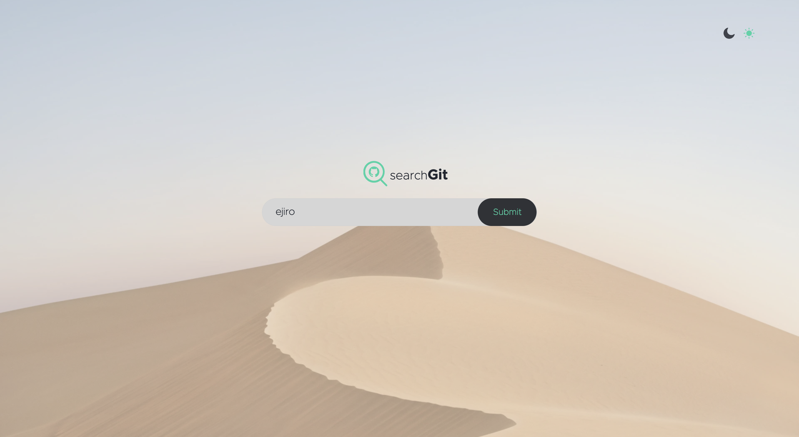
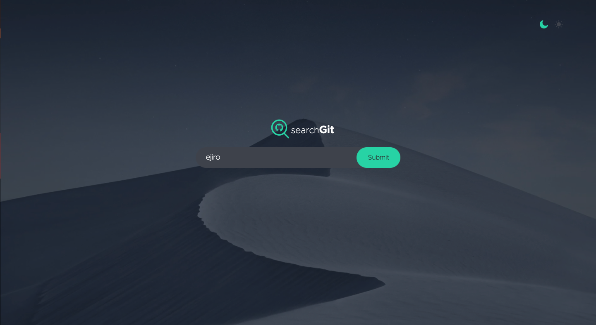
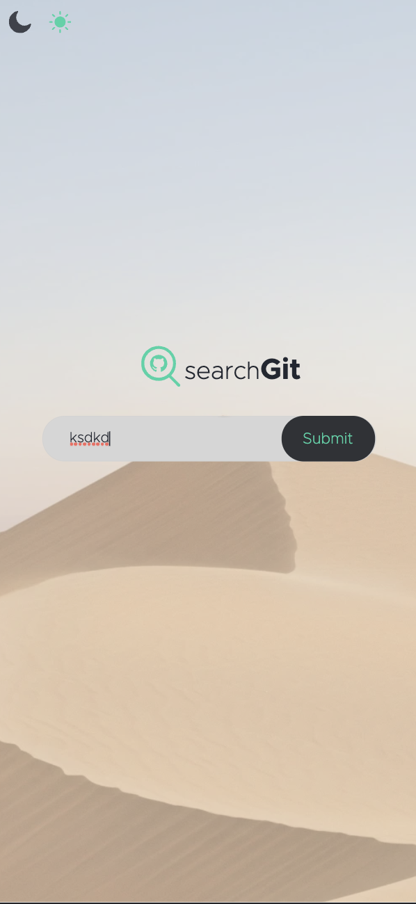
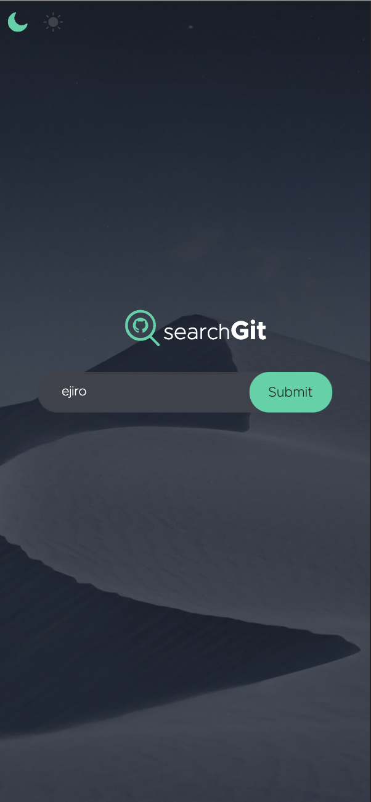

# GitHub user search app

Frontend assessment for (https://www.https://scal.io). Coded by Ejiro Ogidigbo.

## Table of contents

- [Overview](#overview)
  - [The challenge](#the-challenge)
  - [Link](#link)
  - [Built with](#built-with)
  - [Installation](#Installation)
  - [Testing](#Testing)
  - [Layout](#layout)
  - [Screenshots](#screenshots)

## Overview

### The challenge

Users should be able to:

- Launch the app and a Search should be displayed.
- Search for GitHub users by their login.
- See relevant users information based on their search.
- Navigate users list with paginated component.
- See 9 items displayed Per Page.
- Sort list of users.

Additions

- Switch between light and dark themes
- Have the correct color scheme chosen for them based on their computer preferences.
- View the optimal layout for the app depending on their device's screen size
- Interaction design.

### Link

- Live Site URL: [Click here](https://nervous-hugle-48e783.netlify.app)

### Built with

- Semantic HTML5 markup
- CSS custom properties
- Flexbox
- Mobile-first workflow
- TypeScript
- [React](https://reactjs.org/) - JS library
- Context
- CSS Modules
- GitHub users API
- Framer Motion

### Installation

1. Install [**Node JS**](https://nodejs.org/en/).
1. To Clone the Run `npm clone https://github.com/kevinejiro/searchgit.git`
1. [**cd**] into the root of the **project directory**.
1. Run `yarn` on the terminal to install Dependecies

1. Start the application:

**Run Development Build**

```
yarn dev
yarn build
```

### Testing

Client side tests - Run `yarn test` on the terminal while within the **project root directory**.

Client side testing is achieved through the use of **jest** package. **jest** is used to test javascript code in React applications.

### Layout

The designs were created to the following widths:

- Mobile: 375px
- Desktop: 1024px

### Screenshots

- [Desktop](#desktop)
- [Mobile](#mobile)

#### Desktop




#### Mobile



